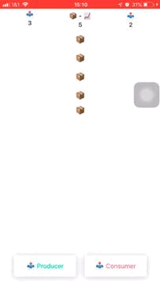

# ReduxExample

First usage of Redux architecture. Used one exercise (below) for implementation.



## Exercise

Simple iOS-App with UITableView and two buttons.
Left Button: Creates a new producer.
Right Button: Creates a new consumer.

Producer: adds a cell every 3 seconds.
Consumer: removes a cell every 4 seconds.
A created producer/consumer will never be removed and will do its job forever.

The user can create producer or consumer how often he wants by clicking the specified buttons.

## Resolution

Trello Board used for organization. - invite link to access it (https://trello.com/invite/b/JOgJZKPu/e959929447a7a80a3dd7ddbb3ac9cd26/studydrive)

## Dependencies
|#|Library|Description|
|-|-|-|
|1|[ReSwift](https://github.com/ReSwift/ReSwift)|Redux-like implementation of the unidirectional data flow architecture.|

## Build instructions

1. An OSX machine
2. Xcode 10.x or higher (Swift 4.2)
3. Install [CocoaPods](https://cocoapods.org/) 
4. Clone this repo:
```
git clone https://github.com/cardoso/ReduxMovieDB
```
5. Download library dependencies using the cocoapods dependency manager (and update the same way):
```
pod install
```
6. Open the Xcode workspace.
7. Build the project by ⌘ + R
